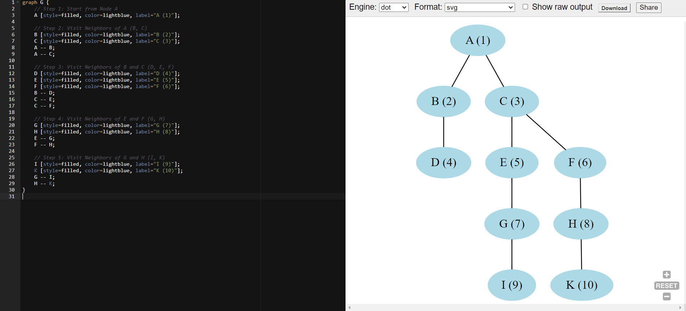

#### whiteboard.md

## Problem Domain
- **Input**: A graph represented by an adjacency list, and a starting node value from which the BFS traversal should begin.
- **Output**: A list containing the values of the nodes visited in Breadth-First Search (BFS) order starting from the given node.

## Test Cases
1. **Test Case 1**:
    - **Input**: 
      - Graph: `{ 'A': ['B', 'C'], 'B': ['A', 'D'], 'C': ['A', 'E', 'F'], 'D': ['B'], 'E': ['C', 'G'], 'F': ['C', 'H'], 'G': ['E', 'I'], 'H': ['F', 'K'], 'I': ['G'], 'K': ['H'] }`
      - Starting Node: `'A'`
    - **Output**: `['A', 'B', 'C', 'D', 'E', 'F', 'G', 'H', 'I', 'K']`
    
2. **Test Case 2**:
    - **Input**: 
      - Graph: `{ 'A': ['B', 'C'], 'B': ['A', 'D'], 'C': ['A', 'E', 'F'], 'D': ['B'], 'E': ['C', 'G'], 'F': ['C', 'H'], 'G': ['E', 'I'], 'H': ['F', 'K'], 'I': ['G'], 'K': ['H'] }`
      - Starting Node: `'C'`
    - **Output**: `['C', 'A', 'E', 'F', 'B', 'G', 'H', 'D', 'I', 'K']`
    
3. **Test Case 3**:
    - **Input**: 
      - Graph: `{ 'A': ['B', 'C'], 'B': ['A', 'D'], 'C': ['A', 'E', 'F'], 'D': ['B'], 'E': ['C', 'G'], 'F': ['C', 'H'], 'G': ['E', 'I'], 'H': ['F', 'K'], 'I': ['G'], 'K': ['H'] }`
      - Starting Node: `'Z'` (Node that doesn't exist)
    - **Output**: `[]`

## Visualization

## Algorithm
1. Initialize an empty set `visited` to keep track of visited nodes.
2. Initialize a queue with the starting node value.
3. Initialize an empty list `result` to store the order of visited nodes.
4. While the queue is not empty:
   - Dequeue a node from the front of the queue.
   - If the node has not been visited:
     - Mark the node as visited by adding it to the `visited` set.
     - Append the node to the `result` list.
     - Enqueue all unvisited neighbors of the node.
5. Return the `result` list.

## Big O
- **Time Complexity:** O(V + E) where V is the number of vertices (nodes) and E is the number of edges. This is because in the worst case, each node and each edge is processed once.
- **Space Complexity:** O(V) where V is the number of vertices. This is because we need space to store the `visited` set, the queue, and the result list, all of which could potentially store all the nodes in the graph.

## Step Through
1. Start with the initial graph and the starting node (e.g., `'A'`).
2. Initialize the `visited` set, `queue` with the starting node, and an empty `result` list.
3. Begin the BFS loop, dequeue the first node, mark it as visited, and add it to `result`.
4. Enqueue all of its unvisited neighbors.
5. Continue this process until the queue is empty.
6. The final `result` list will contain the BFS traversal order starting from the given node.
