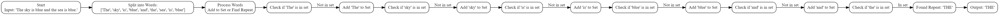

#### whiteboard.md

## Problem Domain
- **Input**: A string of text with words separated by spaces and punctuation.
- **Output**: The first word that repeats in the string, with the first occurrence of the word being considered for the repetition. If no word repeats, return "No Repetition".

## Test Cases
Input String

"The sky is blue and the sea is blue."
"Python is a great language. Python is easy to learn."
"Java JavaScript Java"
"Every day is a new opportunity."
"Just testing for repeated words."

## Visualization
1. **String Analysis**:
   - Split the input string into words.
   - Track occurrences of each word.
   - Identify the first word that appears more than once.

2. **Example**:
   - Input: "The sky is blue and the sea is blue"

## Algorithm
1. Initialize an empty set to track seen words.
2. Split the input string into a list of words.
3. Iterate through each word in the list:
   - Convert the word to uppercase for case-insensitive comparison.
   - If the word is in the set of seen words, return it as the first repeated word.
   - Otherwise, add the word to the set of seen words.
4. If the loop completes without finding a repeat, return "No Repetition".

## Big O
- **Time Complexity:** O(n) where n is the number of words in the string. Each word is processed once and set operations (insertion and lookup) are average O(1).
- **Space Complexity:** O(n) where n is the number of unique words in the string. We need space to store the set of seen words.

## Step Through
1. **Initialize** an empty set `seen_words`.
2. **Split** the input string into words.
3. **Iterate** through the list of words:
   - For each word, convert it to uppercase.
   - Check if the word is already in `seen_words`:
     - If yes, return the word as it is the first repeated word.
     - If no, add the word to `seen_words`.
4. **Finish** iteration and return "No Repetition" if no word was repeated.
