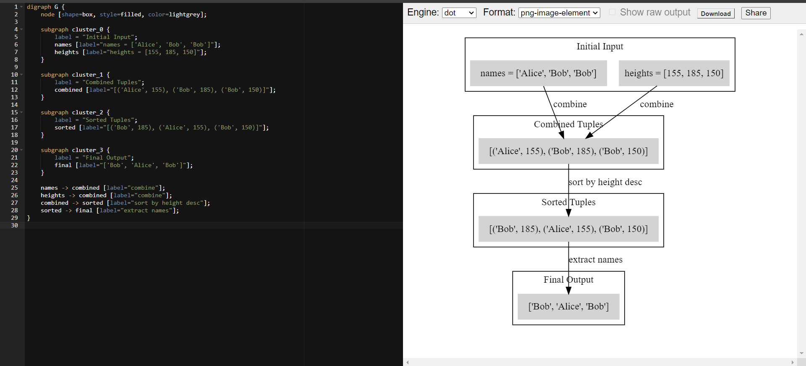

# Whiteboard Explanation for Sort People

## Problem Domain
Reorder and return the list of names based on their corresponding heights in descending order.

- **Input**:
  - `names`: A list of strings representing the names of people.
  - `heights`: A list of integers representing the heights of people corresponding to the names.

- **Output**:
  - A list of strings representing the names reordered by descending heights.

## Test Cases
- **Test Case 1**:
  - Input: `names = ["Alice", "Bob", "Bob"]`, `heights = [155, 185, 150]`
  - Output: `["Bob", "Alice", "Bob"]`
- **Test Case 2**:
  - Input: `names = ["John", "Doe", "Jane"]`, `heights = [190, 165, 180]`
  - Output: `["John", "Jane", "Doe"]`
- **Test Case 3**:
  - Input: `names = []`, `heights = []`
  - Output: `[]`
- **Test Case 4**:
  - Input: `names = ["Single"]`, `heights = [100]`
  - Output: `["Single"]`
- **Test Case 5**:
  - Input: `names = ["A", "B", "C"]`, `heights = [160, 160, 160]`
  - Output: `["A", "B", "C"]`

## Visualization

## Algorithm
1. Combine `names` and `heights` into a list of tuples using `zip(names, heights)`.
2. Sort the list of tuples by the second element (height) in descending order using `sort(key=lambda x: x[1], reverse=True)`.
3. Extract the names from the sorted list of tuples using a list comprehension.
4. Return the list of sorted names.

## Big O
- **Time Complexity**: `O(n log n)` due to the sorting operation, where `n` is the number of elements in the `names` and `heights` lists.
- **Space Complexity**: `O(n)` for storing the combined list of tuples and the sorted list of names.

## Step Through
1. Input `names = ["Alice", "Bob", "Bob"]`, `heights = [155, 185, 150]`.
2. Combine to get `[("Alice", 155), ("Bob", 185), ("Bob", 150)]`.
3. Sort by height in descending order to get `[("Bob", 185), ("Alice", 155), ("Bob", 150)]`.
4. Extract sorted names to get `["Bob", "Alice", "Bob"]`.
5. Return `["Bob", "Alice", "Bob"]`.
