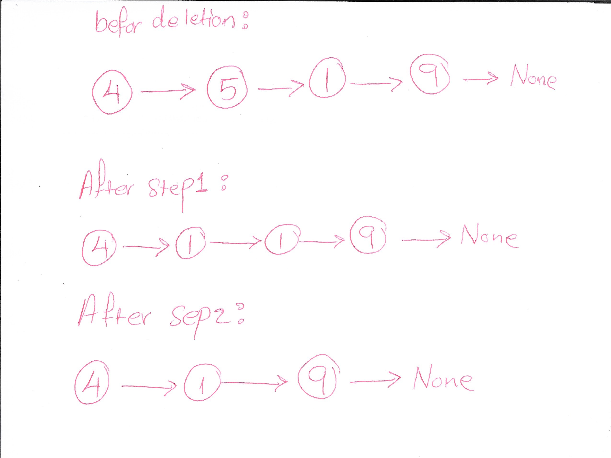

### Work Documentation

## Problem Domain

You are given a singly-linked list. Write a function to delete a node in the linked list. However, you are not given access to the head of the list; instead, you are given access to the node to be deleted directly.

It is guaranteed that the node to be deleted is not a tail node in the list.

Implement the function `delete_node(node)` which takes the node to be deleted as a parameter and modifies the linked list in place.

- **Input**: A singly linked list node to be deleted.
- **Output**: None. Modify the linked list in place by deleting the given node.

## Test Cases

- **Test Case 1**:
  - Input: Linked list: [4, 5, 1, 9], node to delete: 5
  - Expected Output: Linked list should become [4, 1, 9] after deleting node with value 5.
  
- **Test Case 2**:
  - Input: Linked list: [4, 5, 1, 9], node to delete: 1
  - Expected Output: Linked list should become [4, 5, 9] after deleting node with value 1.

## Visualization

## Algorithm
1. Copy the value of the next node to the node to be deleted.
2. Delete the next node by setting the current node's `next` pointer to `node.next.next`.

## Big O
- **Time Complexity**: O(1) - Constant time complexity since we're directly modifying pointers.
- **Space Complexity**: O(1) - Constant space since we're not using any extra data structures.

## Step Through

### Initialization:
Start with the given linked list and the node to be deleted.

### Step 1:
Copy the value of the next node to the current node (`node.val = node.next.val`).

### Step 2:
Delete the next node by updating the current node's `next` pointer to skip the next node (`node.next = node.next.next`).
