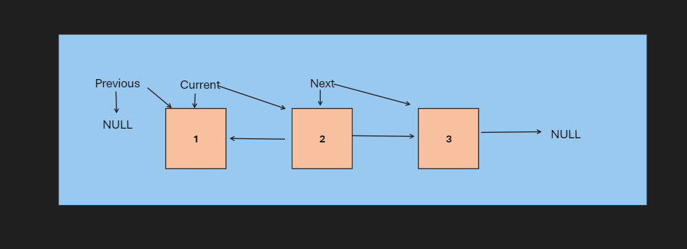

# Reverse LinkedList Project

## Problem Domain
The problem domain in the context of the "Reverse LinkedList Project" refers to the fundamental aspects of the problem that need to be understood before attempting to solve it. It outlines what the problem is and what is required as input and output.

- **Input**:  The problem expects the input to be the head of a linked list. This linked list could contain any number of nodes, with each node having a value and a reference to the next node in the list,
for example: [1, 2, 3, 4, 5]

- **Output**: The desired output is the head of a new linked list that is the reverse of the input linked list. This means that the order of nodes in the original linked list should be reversed in the output linked list,
for example: [5, 4, 3, 2, 1]

## Test Cases
1. **Test Case 1**: 
   - **Input**: [1, 2, 3, 4, 5]
   - **Output**: [5, 4, 3, 2, 1]
   
2. **Test Case 2**: 
   - **Input**: [1]
   - **Output**: [1]
   
3. **Test Case 3**: 
   - **Input**: []
   - **Output**: []
   
4. **Test Case 4**: 
   - **Input**: [1, 2]
   - **Output**: [2, 1]

## Visualization
### Flow of the `reverseLinkedList` function

## Algorithm
1. Initialize a variable `prev` to `None`.
2. Initialize a variable `current` to the head of the list.
3. While `current` is not `None`:
   - Save the next node in `next_node`.
   - Set `current.next` to point to `prev`.
   - Move `prev` to `current`.
   - Move `current` to `next_node`.
4. When the loop ends, return `prev` which will be the new head of the reversed list.

## Big O
- **Time Complexity:** O(n), where n is the number of nodes in the list. We need to visit each node exactly once.
- **Space Complexity:** O(1), as we are using a fixed amount of extra space for some temporary variables.

## Step Through
### Step-by-step with example [1, 2, 3, 4, 5]:

1. **Initial State:**
   - `prev = None`
   - `current = head (1)`

2. **Iteration 1:**
   - `next_node = 2`
   - `current.next = None` (now 1 points to nothing)
   - `prev = 1`
   - `current = 2`

3. **Iteration 2:**
   - `next_node = 3`
   - `current.next = 1` (now 2 points to 1)
   - `prev = 2`
   - `current = 3`

4. **Iteration 3:**
   - `next_node = 4`
   - `current.next = 2` (now 3 points to 2)
   - `prev = 3`
   - `current = 4`

5. **Iteration 4:**
   - `next_node = 5`
   - `current.next = 3` (now 4 points to 3)
   - `prev = 4`
   - `current = 5`

6. **Iteration 5:**
   - `next_node = None`
   - `current.next = 4` (now 5 points to 4)
   - `prev = 5`
   - `current = None`

7. **End:**
   - `prev = 5` (head of the reversed list)

The output is the list [5, 4, 3, 2, 1].
