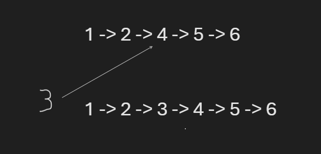

## Problem Domain
- **Input**: The function takes two parameters: a node in the linked list (`before`) and the new node (`new_node`) to be inserted after the `before` node.
- **Output**: The function doesn't return anything directly, but it modifies the linked list by inserting the `new_node` after the `before` node.

## Test Cases
We have one test case:
- **Input**: `before` node with value 2, `new_node` with value 3.
- **Expected Output**: The linked list should be `[1, 2, 3, 4, 5, 6]`.

## Visualization
Before and After inserting node with value 3 after node with value 2:

## Algorithm
1. Check if the `before` node is not None.
2. Set the `next` pointer of the `new_node` to the `next` pointer of the `before` node.
3. Set the `next` pointer of the `before` node to the `new_node`.

## Big O
- **Time Complexity**: O(1)
  - The operation of inserting a node after another node in a linked list is constant time because it involves updating pointers.
- **Space Complexity**: O(1)
  - We are not using any extra space that depends on the input size.

## Step Through

1. **Create a linked list**: `[1, 2, 4, 5, 6]`
   - We start with an empty linked list and append the values `[1, 2, 4, 5, 6]` to it.
   - The linked list now looks like: `1 -> 2 -> 4 -> 5 -> 6`.

2. **Find the `before` node**: Node with value 2.
   - We traverse the linked list to find the node with value 2.

3. **Create the `new_node`**: Node with value 3.
   - We create a new node with value 3.

4. **Call `insert_after(before, new_node)`**.
   - We call the `insert_after` function with the `before` node (node with value 2) and the `new_node` (node with value 3).

5. **Update pointers**: Set `new_node.next` to `before.next` and `before.next` to `new_node`.
   - We update the pointers to insert the `new_node` after the `before` node:
     - Set `new_node.next` to `before.next`, so `new_node.next` points to the node with value 4.
     - Set `before.next` to `new_node`, so `before.next` (which previously pointed to the node with value 4) now points to the `new_node`.

After these steps, the linked list will be `[1, 2, 3, 4, 5, 6]`, with the `new_node` (value 3) inserted after the `before` node (value 2).
