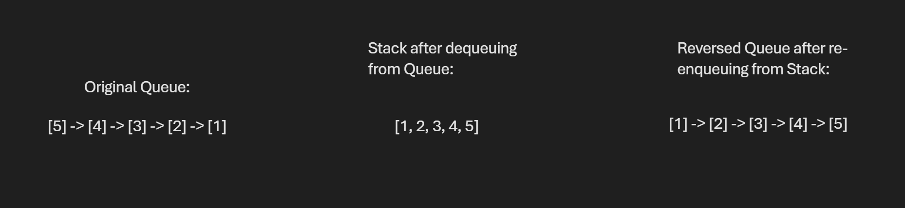

# Reverse Queue Solution

## Problem Domain
a function that it takes a queue, Reverse it and return the new queue.

### Input:
A queue with elements that need to be reversed.

### Output:
The queue with elements in reversed order.

## Test Cases

1. **Test Case 1:**
   - **Input:** [5, 4, 3, 2, 1]
   - **Expected Output:** [1, 2, 3, 4, 5]

2. **Test Case 2:**
   - **Input:** [1]
   - **Expected Output:** [1]

3. **Test Case 3:**
   - **Input:** []
   - **Expected Output:** []

## Visualization

## Algorithm

1. **Initialize a Stack:**
   - Create an empty list to simulate a stack.

2. **Transfer Elements from Queue to Stack:**
   - While the queue is not empty:
     - Dequeue the front element from the queue.
     - Push the dequeued element onto the stack.

3. **Transfer Elements from Stack back to Queue:**
   - While the stack is not empty:
     - Pop the top element from the stack.
     - Enqueue the popped element back to the queue.

4. **Return the Reversed Queue:**
   - The queue now contains the elements in reversed order.

## Big O

### Time Complexity:
- **O(n)**: Each element is moved twice (once to the stack and once back to the queue).

### Space Complexity:
- **O(n)**: Additional space is required to store the elements in the stack.

## Step Through

### Initialize the Queue:

Create a Queue object and enqueue elements [5, 4, 3, 2, 1].

### Call reverse_queue(queue):

Initialize an empty stack.

### Transfer Elements from Queue to Stack:

Dequeue 5 from the queue and push it onto the stack.
Dequeue 4 from the queue and push it onto the stack.
Repeat until all elements are moved to the stack.

### Transfer Elements from Stack back to Queue:

Pop 1 from the stack and enqueue it to the queue.
Pop 2 from the stack and enqueue it to the queue.
Repeat until all elements are moved back to the queue.

### Return the Reversed Queue:

The queue now contains elements [1, 2, 3, 4, 5].

### Verify with Test Cases:

Use the provided test cases to ensure the function works correctly.