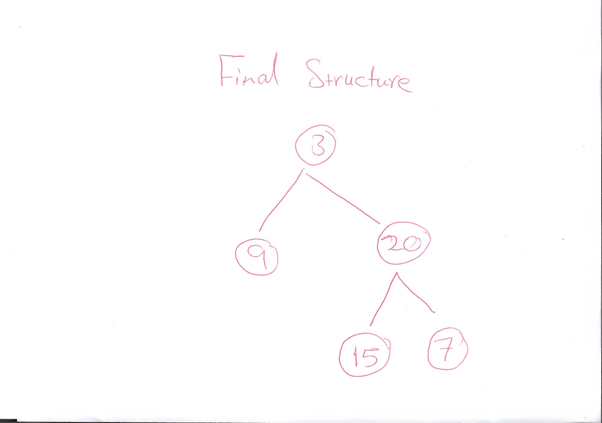

# Whiteboard

## Problem Domain

- **Input**:
  - `preorder`: A list of integers representing the preorder traversal of a binary tree.
  - `inorder`: A list of integers representing the inorder traversal of the same binary tree.
- **Output**:
  - A binary tree constructed from the given preorder and inorder traversal lists.

## Test Cases

- **Example 1**:
  - Input: `preorder = [3, 9, 20, 15, 7]`, `inorder = [9, 3, 15, 20, 7]`
  - Output: `[3, 9, 20, null, null, 15, 7]`
- **Example 2**:
  - Input: `preorder = [-1]`, `inorder = [-1]`
  - Output: `[-1]`
- **Additional Case**:
  - Input: `preorder = [1, 2, 4, 5, 3, 6, 7]`, `inorder = [4, 2, 5, 1, 6, 3, 7]`
  - Output: `[1, 2, 3, 4, 5, 6, 7]`

## Visualization
1. **Example 1**:
   - Preorder: [3, 9, 20, 15, 7]
   - Inorder: [9, 3, 15, 20, 7]

   The tree:
   
   .jpg>)

## Algorithm
1. **Base Case**: If either the preorder or inorder list is empty, return `None`.
2. **Root Identification**: The first element of the preorder list is the root of the tree.
3. **Root Index in Inorder List**: Locate the root in the inorder list. This splits the list into left and right subtrees.
4. **Recursively Build Subtrees**:
- Use elements before the root in the inorder list for the left subtree.
- Use elements after the root in the inorder list for the right subtree.
5. **Recursive Construction**:
- Construct the left subtree with the corresponding part of the preorder and inorder lists.
- Construct the right subtree similarly.

## Big O
- **Time Complexity**: O(n^2) in the worst case due to the `index` call within each recursive step. Optimized to O(n) with a hashmap to store indices of inorder elements.
- **Space Complexity**: O(n) due to the recursion stack and storage of the tree nodes.

## Step Through

1. **Start** with the preorder list `[3, 9, 20, 15, 7]` and inorder list `[9, 3, 15, 20, 7]`.
2. **Root Identification**: The root is `3` (the first element of the preorder list).
3. **Split Inorder List**: 
   - Elements to the left of `3` in the inorder list: `[9]` (left subtree).
   - Elements to the right of `3` in the inorder list: `[15, 20, 7]` (right subtree).
4. **Recursive Construction**:
   - Construct the left subtree with:
     - Preorder list: `[9]`
     - Inorder list: `[9]`
   - Construct the right subtree with:
     - Preorder list: `[20, 15, 7]`
     - Inorder list: `[15, 20, 7]`
5. **Continue Recursively**:
   - For the left subtree of root `3`, the preorder and inorder lists are both `[9]`, making `9` the root of the left subtree with no further children.
   - For the right subtree of root `3`, the root is `20` (first element of `[20, 15, 7]`):
     - Split the inorder list `[15, 20, 7]` around `20`:
       - Left subtree: `[15]`
       - Right subtree: `[7]`
     - Construct the left subtree of `20` with:
       - Preorder list: `[15]`
       - Inorder list: `[15]`
     - Construct the right subtree of `20` with:
       - Preorder list: `[7]`
       - Inorder list: `[7]`

