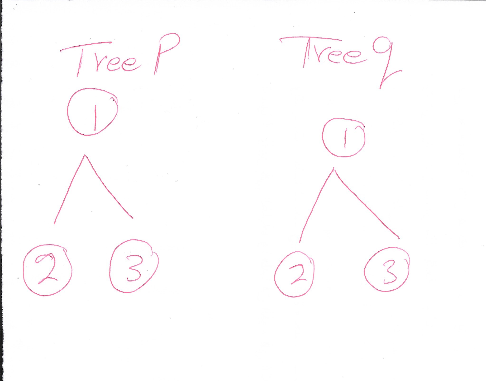

# Problem Domain

## Binary Tree Structural Equality using Breadth-First Traversal

- **Input**: Two binary trees `p` and `q`.
- **Output**: Boolean indicating whether the trees are structurally identical and have the same node values.

# Test Cases

- Example 1:
Input: p = [1,2,3], q = [1,2,3]
Output: true

- Example 2:
Input: p = [1,2], q = [1,null,2]
Output: false

- Example 3:
Input: p = [1,2,1], q = [1,1,2]
Output: false

# Visualization

Step-by-Step Breadth-First Traversal and Comparison
Initialization:

Start with the roots of both trees in their respective queues:
Queue p: [1]
Queue q: [1]

Processing Nodes:

Dequeue nodes from both queues and compare their values:
Node p: 1, Node q: 1 (Match)

Enqueue Children:

Enqueue the children of the current nodes (if any):
Queue p: [2, 3]
Queue q: [2, 3]

Continue Processing:

Dequeue and compare the next set of nodes:
Node p: 2, Node q: 2 (Match)
Node p: 3, Node q: 3 (Match)

Final Comparison:

Both queues are now empty, indicating all nodes have been processed and matched correctly.

## Algorithm

To determine if two binary trees `p` and `q` are identical:

1. Implement a `TreeNode` class to represent nodes in the tree.
2. Define a function `is_same_tree(p, q)`:
   - Use a breadth-first traversal approach using a queue.
   - Compare corresponding nodes from `p` and `q` during traversal.

## Big O

- **Time Complexity**: O(n), where n is the number of nodes in the larger tree.
- **Space Complexity**: O(n), for the queue used in breadth-first traversal.

## Step Through

### Example Execution: Consider p = [1,2,3] and q = [1,2,3]

Step 1: Initialize queues with roots of p and q.
   - Queue p: [1]
   - Queue q: [1]

Step 2: Dequeue nodes, compare values.
   - Node p: 1, Node q: 1 (Match)

Step 3: Continue until all nodes are processed.
   - Queue p: [2, 3]
   - Queue q: [2, 3]

Step 4: Dequeue nodes, compare values.
   - Node p: 2, Node q: 2 (Match)
   - Node p: 3, Node q: 3 (Match)

Step 5: Both queues are empty. All values matched.
   - Return True

