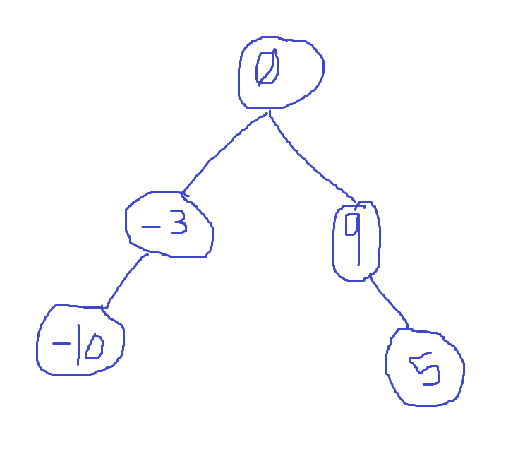

## Problem Domain
Convert a sorted array into a height-balanced binary search tree (BST).

- **Input**:
  - A sorted array of integers `nums`.
  
- **Output**:
  - The root node of the height-balanced BST.

## Test Cases
1. **Input**: `[-10, -3, 0, 5, 9]`
   - **Output**: A height-balanced BST such that in-order traversal returns `[-10, -3, 0, 5, 9]`
2. **Input**: `[1, 3]`
   - **Output**: A height-balanced BST such that in-order traversal returns `[1, 3]`
3. **Input**: `[]`
   - **Output**: `None` (empty tree)
4. **Input**: `[1]`
   - **Output**: A BST with a single node `1`.

## Visualization
For the input `[-10, -3, 0, 5, 9]`:

## Algorithm
1. Define a helper function `helper(start, end)` to construct the BST:
   - If `start > end`, return `None`.
   - Calculate the middle index `mid = (start + end) // 2`.
   - Create a new `TreeNode` with the value `nums[mid]`.
   - Recursively construct the left subtree with `helper(start, mid - 1)`.
   - Recursively construct the right subtree with `helper(mid + 1, end)`.
2. Call the `helper` function with the initial range `0` to `len(nums) - 1`.
3. Return the root of the BST.

## Big O
- **Time Complexity**: O(n), where n is the number of elements in the array. Each element is processed once.
- **Space Complexity**: O(log n), due to the recursion stack depth for a balanced tree.

## Step Through
For `nums = [-10, -3, 0, 5, 9]`:

1. **Initial Call**: `helper(0, 4)`
   - `mid = 2`
   - `root = TreeNode(0)`

2. **Construct Left Subtree**: `helper(0, 1)`
   - `mid = 0`
   - `root.left = TreeNode(-10)`
     - **Left Subtree**: `helper(0, -1)` returns `None`
     - **Right Subtree**: `helper(1, 1)`
       - `mid = 1`
       - `root.left.right = TreeNode(-3)`
         - **Left Subtree**: `helper(1, 0)` returns `None`
         - **Right Subtree**: `helper(2, 1)` returns `None`

3. **Construct Right Subtree**: `helper(3, 4)`
   - `mid = 3`
   - `root.right = TreeNode(5)`
     - **Left Subtree**: `helper(3, 2)` returns `None`
     - **Right Subtree**: `helper(4, 4)`
       - `mid = 4`
       - `root.right.right = TreeNode(9)`
         - **Left Subtree**: `helper(4, 3)` returns `None`
         - **Right Subtree**: `helper(5, 4)` returns `None`
